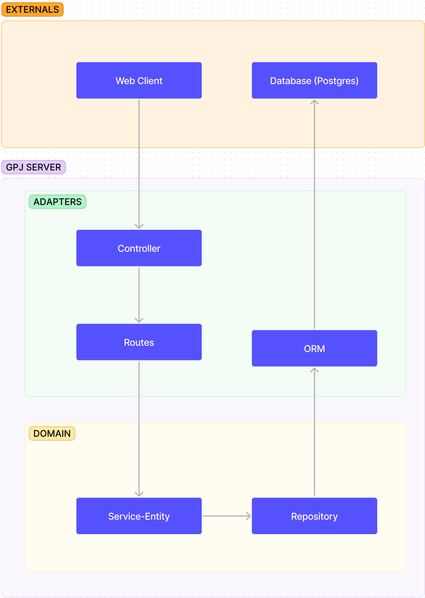

# Gestor de Processor Jurídicos (GPJ)

This is the repository containing both backend and frontend applications of GPJ.

# Team members

## Backend engineers

> Diego Vinicius de Oliveira Silva 
> Rafael Lenti Barbosa

## Frontend engineers

> Vinícius Correia Fonseca de Castro 
> Miguel Scatolin Teixeira

# Project scope

The main objective of the system is to efficiently manage the entire process of a law firm, from the initiation of a trial process until its conclusion. To accomplish this goal, we are offering our users the capability to create and manage the essential entities required for this process, including users, companies, and trials.

Our system enables users to create trials that are connected to the companies that require legal action, and track the process status through multiple stages until completion. Users can easily update the trial progress and keep all stakeholders informed.

The system is designed to improve users' efficiency by providing a user-friendly interface that simplifies their work. The interface includes fast-loading tables with search and filter options that enable users to quickly access relevant information.

This new system is a significant improvement over the traditional approach of using Excel sheets in small law firms, which is prone to errors and duplication of data. With our system, users can focus on their core work, managing trials and delivering results, rather than managing administrative tasks and data inaccuracies.

# Main technologies

For the backend we will use Node.js with TypeScript, using fastify as the web framework and PostgreSQL together with Prisma (ORM) for the database handling.
On the frontend side we will use React with TypeScript.

# User stories

1. As a user, I want to be able to log in.
2. As an admin, I want to be able to create and delete users in the system.
3. As an admin, I want to be able to manage user permissions.
4. As a user, I want to be able to create and delete companies.
5. As a user, I want to be able to create a process linked to myself and one or more companies.
6. As a user, I want to be able to track the progress of each process, to manage its steps and status.
7. As a user, I want to be able to download a CSV file with the list of all processes being carried out by the company.
8. As a user, I want to be able to filter my processes based on status, process type, customer, office, or deadline.
9. As a user, I want to be able to easily identify processes that are overdue.
10. As a user, I want to be able to search for processes based on all text fields in the table.
11. As a user, I want to be able to add comments to a process to record relevant information and collaborate with the team responsible for the process.

# User stories and tasks

## Story 1: User login
As a user, I want to be able to log in.

Tasks and responsibilities:

- [ ] Set up login page [Diego Vinicius]
- [ ] Implement user and password validation on the backend [Vinícius Correia]
- [ ] Test login with different combinations of user and password [Rafael Lenti]
- [ ] Create and implement user session logic [Rafael Lenti]

## Story 2: User management
As an admin, I want to be able to create and delete users in the system.

Tasks and responsibilities:

- [ ] Create user registration form [Diego Vinicius]
- [ ] Implement insertion and deletion logic of users in the database [Vinícius Correia]
- [ ] Add access permissions to the user creation and deletion functionality [Miguel Scatolin]
- [ ] Test the creation and deletion of users with different levels of access [Rafael Lenti]

## Story 3: User permission management
As an admin, I want to be able to manage user permissions.

Tasks and responsibilities:

- [ ] Add permissions field in the user table [Rafael Lenti]
- [ ] Implement permission logic on the backend [Vinícius Correia]
- [ ] Configure interface for managing user permissions [Miguel Scatolin]
- [ ] Test different levels of user permissions [Rafael Lenti]

## Story 4: Company creation and deletion
As a user, I want to be able to create and delete companies.

Tasks and responsibilities:

- [ ] Create company registration form [Diego Vinicius]
- [ ] Implement insertion and deletion logic of companies in the database [Vinícius Correia]
- [ ] Add access permissions to the company creation and deletion functionality [Miguel Scatolin]
- [ ] Test the creation and deletion of companies with different levels of access [Rafael Lenti]

## Story 5: Process creation and linking
As a user, I want to be able to create a process linked to myself and one or more companies.

Tasks and responsibilities:

- [ ] Create process model on the backend [Rafael Lenti]
- [ ] Implement route to create a new process [Rafael Lenti]
- [ ] Add relationship between user, companies, and processes in the model [Diego Vinicius]
- [ ] Add validations and unit tests on the backend [Diego Vinicius]
- [ ] Add fields to link companies on the process creation screen [Vinícius Correia]
- [ ] Implement selection and persistence logic of companies on the backend [Vinícius Correia]

## Story 6: Process tracking
As a user, I want to be able to track the progress of each process, to manage its steps and status.

Tasks and responsibilities:

- [ ] Create step model on the backend [Diego Vinicius]
- [ ] Add relationship between steps and processes in the model [Rafael Lenti]
- [ ] Implement route to add a new step to an existing process [Rafael Lenti]
- [ ] Implement logic to update step status and progress [Vinícius Correia]
- [ ] Add screen to view steps and status of processes [Miguel Scatolin]
- [ ] Implement logic to retrieve steps and status of processes on the backend [Miguel Scatolin]

# Sprint 2

## Why is the system adopting this architecture?
The system is utilizing Hexagonal Architecture (also known as Ports and Adapters pattern). This design choice offers numerous benefits. It separates the core logic of the application (the domain) from the technologies used for inputs and outputs (the adapters). This results in a more flexible, maintainable, and testable system. It reduces the impact of infrastructure changes on the business logic, allowing us to switch out databases, UI frameworks, etc., with minimal code changes.

## What are the ports and adapters? What's their purpose?
The ports in our system are the functions found in src/domain/. These ports are used by routes, which are the adapters. Ports define the inputs and outputs for our system's core business logic.

The adapters in our system are located in src/routes, src/controllers, and types/repository. Adapters are responsible for translating data between the formats convenient for the domain and the formats convenient for things like databases or web requests.

The src/routes is an adapter connecting with Fastify, and src/controllers is an adapter that consolidates various routes.

We also have an ORM (Object-Relational Mapping) adapter in types/repository, where the adapter "converts" the ORM into a repository. It makes it possible to switch between ORMs as long as they conform to the types defined in types/repository.

The ORM itself is also an adapter for the database, as it makes it possible to change the database used among other configurations directly in the ORM initialization. This allows us to change the technology of the database without having to alter the business logic of our application.

